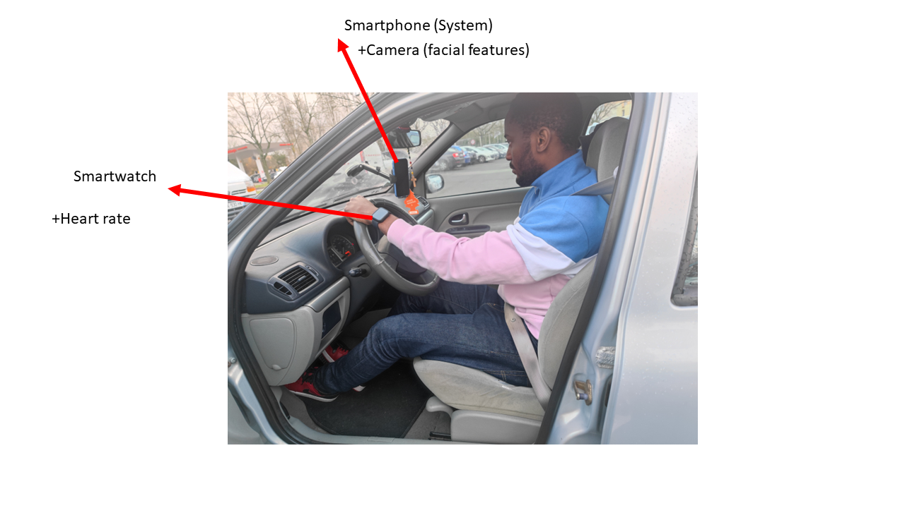

# Étude des applications de détection de somnolence chez les conducteurs de véhicules et mise en place d’une solution innovante

Ce projet à pour but la réalisation d’une solution robuste à base d’objets connectés pour la détection précoce des situations de somnolence des conducteurs des véhicules. 
Le potentiel d’impact social et économique des résultats de cette problématique est élevé. En effet, les accidents de la route liés à la fatigue comptent parmi les principales causes de décès dans le monde.

La solution développée aura le potentiel d’améliorer la sécurité et de sauver des vies en contribuant à prévenir les accidents. Par ailleurs, le transfert technologique de ces solutions vers les constructeurs automobiles sera également facilité. Des implémentations préliminaires de tels systèmes sont intégrées dans les voitures par certains constructeurs, par exemple Volkswagen.

Cependant, ces implémentations sont basées sur la surveillance de profils de conduite irréguliers, par exemple des mouvements irréguliers du volant et des déviations de voie indiquant que le conducteur commence à avoir sommeil. Souvent, ces profiles erratiques ne sont détectés qu’à des stades avancés de somnolence. Dans ce projet, l’idée est plutôt d’exploiter des modalités qui permettent de détecter la somnolence dans des phases précoces à l’aide, par exemple, de caméras embarquées ou de capteurs de rythmes cardiaques qui monitorent le conducteur de manière continue.

<b> Encadrant : Massinissa HAMIDI (massinissa.hamidi@univ-evry.fr) </b>

# Description de la solution

Dans ce projet, nous avons mis en place une solution de détection de la somnolence basé sur smartphone. Il se base sur les caractéristiques visuelles capturés à l'aide de la caméra du smartphone et du rythme cardiaque capturé à l'aide de montre intelligente. Ainsi, notre solution permet d'associer l'accurence du rythme cardiaque à la caméra pour obtenir un solution robuste et performant, permettant de venir à bout des problématiques (Mauvaise luminosité, position de la caméra) de la détection via caméra. De plus, vue que l'on propose d'utiliser une montre intelligente, on se repose sur un produit du quotidien , qui nous permet d'etre non invasive.

  
  
   Présentation de la solution

Notre solution comprend deux parties : 
<ul>
  <li>La fusion de données basée sur l'ontologie pour la prise de décision en matière de somnolence </li>
  
  Notre solution est basée sur la surveillance du rythme cardiaque et des caractéristiques visuelles du conducteur. Nous utilisons un modèle de classification spécifique pour chaque type de mesure. Le résultat de chaque modèle est ensuite transmis à l'ontologie pour la prise de décision. D'autre part, nous recueillons des informations sur l'environnement et la conduite, qui sont fournies à l'ontologie pour améliorer sa prise de décision. Ces informations comprennent les conditions météorologiques, la durée de la conduite et l'heure. L'ensemble {résultat du modèle de fréquence cardiaque, résultat du modèle de caractéristiques visuelles, conditions météorologiques, durée de la conduite, heure} est utilisé pour le raisonnement, à l'issue duquel le niveau de somnolence est déterminé.

  <li>Une solution non invasive basée sur l'IoT à faible coût pour la détection de la somnolence.</li>
  Notre solution se déploit sur smartphone ne necessitant aucun autre dispositif. Pour fonctionner,il nécessite au moins l'utilisation de la caméra ou de la montre. Les montres peuvent être utilisées à l'intérieur et à l'extérieur de la voiture, ce qui constitue une option moins invasive pour les conducteurs qui en possèdent déjà une. Cela permet de tirer parti des appareils existants et de garantir la facilité d'utilisation. En outre, les capteurs de fréquence cardiaque sont des caractéristiques de base de toutes les montres intelligentes.Nous avons éssayer de travailler sur des montres low-cost afin de proposer une solution pouvant etre abordable. Fusionner le rythme cardiaque avec la caméra a permet d'avoir une solution robuste. 

</ul>

  
  
  Architecture de notre solution

# Prise en main du projet

<b> Environnement de développement </b>

Pour le developpement :
<ul>
  Pour
  <li>PC ACER 16GB RAM </li>
  <li>Windows 11</li>
  <li>Android Studio Hedgehog | 2023.1.1</li>
   <li>Git</li>
</ul>

Pour la solution :

 <ul>
   
  <li>Smarphone Xiami Mi 11</li>
  <li>Mi Band 5 (Montre intellligente)</li>

 

   
   Prototype finale de la solution
 

  
</ul>

<b> Téléchargement du projet</b>

Pour telecharger le projet, il suffit de cloner le projet en utilisant git dans le repertoire de son choix. La commande est la suivante :

`` git clone  https://github.com/evry-paris-saclay/2023-m2cns-rd-somnolence.git ``

Il est important de spécifier que le code de la solution incluant toutes les fonctionalités se trouve dans <b>2023-m2cns-rd-somnolence/src/android/somnolence.zip</b>, il faut le décompresser et l'ouvrir avec android studio.
A partir de celà, on peut modifier le projet comme on veut.

# Amélioration à faire sur le projet

<ul>

  <li><b>Evaluation de notre solution</b> </li>
  
  La prémière chose à faire pour améliorer cet projet est d'effectuer une évaluation avec les produits existants. <b>A notre connaissance, nous n'avons pas pu trouver de solution basé sur smartphone combinant le rythme cardiaque, les caractéristiques faciaux et une ontologie pour la détection de la somnolence</b>. Cépendant une évaluation pourrait vraiment determiner la robustesse de la solution et conduire à améliorer considérablement les performences pour obténir un système complet.
  
  <li><b>Développement d'un modèle dédié à la detection de la somnolence via la caméra</b> </li>
  
  La solution développé actuellement n'utilise pas de modèle dédié à la détection de la somnolence via la caméra. Il se base sur le modèle de dectection de visage de MLKIT développé par Google.
  Le principe consiste à utiliser le modèle de detection de visage pour déterminer le pourcentage de fermeture des yeux et d'ouverture de la bouche pour determiner si la personne somnole. A partir d'un certain nombre de condition, on arrive à avoir une solution qui fonctionne bien. Cépendant malgré nos bons résultats, c'est pas une solution vraiment dédié à la detection de somnolence. Ainsi, on prévoit de dévolopper notre propre modèle pour améliorer la robustesse de la solution. On a récueilli un certains nombre de dataset pouvant etre utiliser pour l'entrainement d'un modèle. On retrouve le lien de ces datasets dans le repertoire <b>Dataset</b>. Il ya aussi un script shell pour télecharger ces datasets et les dezipper selon le répertoire de son choix. 

Pour utiliser le scritp shell, il suffit de se rendre dans le répertoire dataset et executer cette commande : 

`` .\download_all_datasets.bat ``

  <li><b>Amélioration de l'ontologie</b></li>

  Dans la version actuelle de la solution, les règles dans l'ontologie ne prennent en compte que l'impact que peuvent avoir la température, les heures de conduites dangereuses, et les jours et les dates désignés comme dangereuse.
  On 

  <li><b>Amélioration de l'application android</b></li>

  <li><b>Introduire la notion de stockage pour le stockage</b></li>

   <li><b>Géneralisation de la communication avec d'autres  type de montre intélligente</b></li>

</ul>

# Démonstration :

A partir de détection l'utilisateur récoit une notification via <b>Telegram</b> :

| Capture d'ecran 1                            | Capture d'écran  2                        |
| ----------------------------------- | ----------------------------------- |
|  |  |

La vidéo de demonstration du système est ci-dessous:

  
<video align="center" src="https://github.com/evry-paris-saclay/2023-m2cns-rd-somnolence/assets/104743493/84a6167d-630b-4e61-8c9a-2b403d299620">

