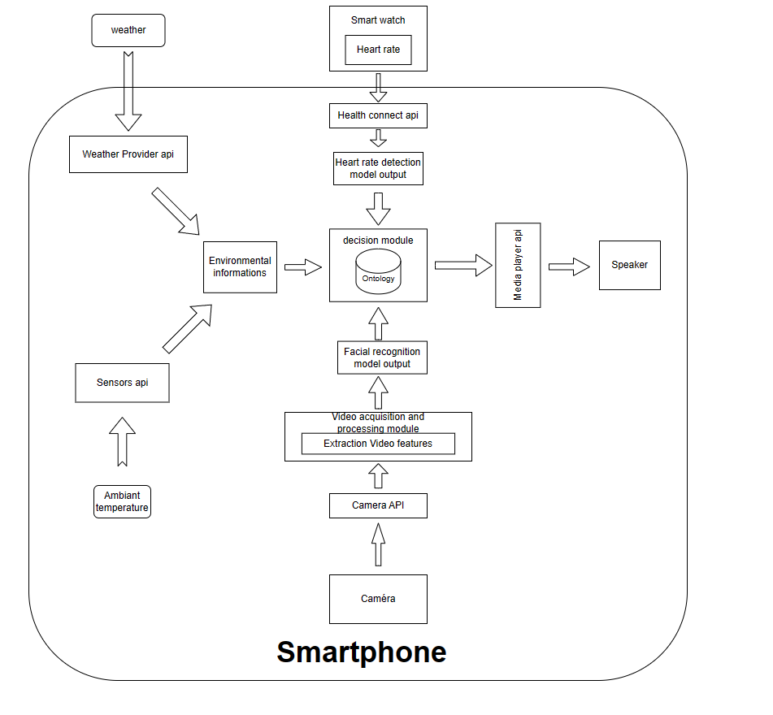

# Étude des applications de détection de somnolence chez les conducteurs de véhicules et mise en place d’une solution innovante

Ce projet à pour but la réalisation d’une solution robuste à base d’objets connectés pour la détection précoce des situations de somnolence des conducteurs des véhicules. 
Le potentiel d’impact social et économique des résultats de cette problématique est élevé. En effet, les accidents de la route liés à la fatigue comptent parmi les principales causes de décès dans le monde.

La solution développée aura le potentiel d’améliorer la sécurité et de sauver des vies en contribuant à prévenir les accidents. Par ailleurs, le transfert technologique de ces solutions vers les constructeurs automobiles sera également facilité. Des implémentations préliminaires de tels systèmes sont intégrées dans les voitures par certains constructeurs, par exemple Volkswagen.

Cependant, ces implémentations sont basées sur la surveillance de profils de conduite irréguliers, par exemple des mouvements irréguliers du volant et des déviations de voie indiquant que le conducteur commence à avoir sommeil. Souvent, ces profiles erratiques ne sont détectés qu’à des stades avancés de somnolence. Dans ce projet, l’idée est plutôt d’exploiter des modalités qui permettent de détecter la somnolence dans des phases précoces à l’aide, par exemple, de caméras embarquées ou de capteurs de rythmes cardiaques qui monitorent le conducteur de manière continue.

<b> Encadrant : Massinissa HAMIDI (massinissa.hamidi@univ-evry.fr) </b>

# Description de la solution

Dans ce projet, nous avons mis en place une solution de détection de la somnolence basé sur smartphone. Il se base sur les caractéristiques visuelles capturés à l'aide de la caméra du smartphone et du rythme cardiaque capturé à l'aide de montre intelligente. Ainsi, notre solution permet d'associer l'accurence du rythme cardiaque à la caméra pour obtenir un solution robuste et performant, permettant de venir à bout des problématiques (Mauvaise luminosité, position de la caméra) de la détection via caméra. De plus, vue que l'on propose d'utiliser une montre intelligente, on se repose sur un produit du quotidien , qui nous permet d'etre non invasive.

  
  
   Présentation de la solution

Notre solution comprend deux parties : 
<ul>
  <li>La fusion de données basée sur l'ontologie pour la prise de décision en matière de somnolence </li>
  
  Notre solution est basée sur la surveillance du rythme cardiaque et des caractéristiques visuelles du conducteur. Nous utilisons un modèle de classification spécifique pour chaque type de mesure. Le résultat de chaque modèle est ensuite transmis à l'ontologie pour la prise de décision. D'autre part, nous recueillons des informations sur l'environnement et la conduite, qui sont fournies à l'ontologie pour améliorer sa prise de décision. Ces informations comprennent les conditions météorologiques, la durée de la conduite et l'heure. L'ensemble {résultat du modèle de fréquence cardiaque, résultat du modèle de caractéristiques visuelles, conditions météorologiques, durée de la conduite, heure} est utilisé pour le raisonnement, à l'issue duquel le niveau de somnolence est déterminé.

  <li>Une solution non invasive basée sur l'IoT à faible coût pour la détection de la somnolence.</li>
  Notre solution se déploit sur smartphone ne necessitant aucun autre dispositif. Pour fonctionner,il nécessite au moins l'utilisation de la caméra ou de la montre. Les montres peuvent être utilisées à l'intérieur et à l'extérieur de la voiture, ce qui constitue une option moins invasive pour les conducteurs qui en possèdent déjà une. Cela permet de tirer parti des appareils existants et de garantir la facilité d'utilisation. En outre, les capteurs de fréquence cardiaque sont des caractéristiques de base de toutes les montres intelligentes.Nous avons éssayer de travailler sur des montres low-cost afin de proposer une solution pouvant etre abordable. Fusionner le rythme cardiaque avec la caméra a permet d'avoir une solution robuste. 

</ul>

  
  
  Architecture de notre solution

# Prise en main du projet

<b> Environnement de développement </b>

Pour le developpement :
<ul>
  <li>PC ACER 16GB RAM </li>
  <li>Windows 11</li>
  <li>Android Studio Hedgehog | 2023.1.1</li>
   <li>Git</li>
</ul>

Pour la solution :

 <ul>
   
  <li>Xiami Mi 11 (Smarphone)</li>
  <li>Mi Band 5 (Montre intellligente) avec un prix de 50 euros</li>
  <li>Minimum Android 12 (niveaux d'API 31)</li>
   
 

   
   Prototype finale de la solution
 

  
</ul>

<b> Téléchargement du projet</b>

Pour telecharger le projet, il suffit de cloner le projet en utilisant git dans le repertoire de son choix. La commande est la suivante :

`` git clone  https://github.com/evry-paris-saclay/2023-m2cns-rd-somnolence.git ``

Il est important de spécifier que le code de la solution incluant toutes les fonctionalités se trouve dans <b>2023-m2cns-rd-somnolence/src/android/somnolence_final.zip</b>, il faut le décompresser et l'ouvrir avec android studio.
A partir de celà, on peut modifier le projet comme on veut.

<b>Bibliothèque utilisé dans android studio</b>
<ul>
  <li><b>Ontologie</b> 
L'ontologie a développée sur android en utilisant la bibliothèque <a href="https://chaquo.com/chaquopy/"><b>Chaquopy</b></a>. C'est une biblithèque géniale qui permet d'executer du python sur android. Ensuite, on a utilisé la librairie python <b>OWL ready 2</b> pour créer et gérer notre ontologie.
  </li>
  <li><b>Detection de la somnolence par caméra</b> 
    Pour cette fonctionnalité, on a utilisé la librairie <a href="https://developers.google.com/ml-kit?hl=fr"><b>MLKit</b></a> développé par google. Elle permet d'utiliser des modèles déja entrainé pour des tâches  telles que la détection de visage, d'object, de code barre et autres.
  </li>
  <li><b>Communication et detection de la somnolence par montre intelligente</b> 
  On a utilisé le package <a href="https://developer.android.com/develop/connectivity/bluetooth/ble/ble-overview"><b>Bluetooth Low Energy  (BLE)</b></a> définit dans android pour communiquer avec notre montre. Les données sont ensuites récuillis via le protocole BLE. Ensuite concernant la détection de la somnolence via le rythme cardiaque, on s'est basé sur l'étude :
    
    Ashiqur Rahman, Mamun Bin Harun Hriday, Riasat Khan, Computer vision-based approach to detect fatigue driving and face mask for edge computing device, Heliyon, Volume 8, Issue 10,2022,e11204,ISSN 2405-8440,https://doi.org/10.1016/j.heliyon.2022.e11204

 <b> Leur travail spécifie qu'une personne fatigué a un BPM génerallement inférieur à 67.</b>
  </li>
  
  <li><b>Alerting</b> 
    
  Pour l'alerting, notre solution se base sur l'utilisation du package <a href="https://developer.android.com/media/platform/mediaplayer"><b>MediaPlayer</b></a> pour génerer des notifications audio depuis le téléphone.
  </li>

<li><b>Météo</b> 
  
 Pour la météo, on a utilisé API de <a href="https://openweathermap.org/api"><b>Open Weather</b></a>. C'est un site qui propose une api pour obtenir la météo à temps réel en spécifiant une localisation. Le site décrit de manière génerale comment utiliser l'API.
  </li>
  
</ul>

<b>Explication du code</b>

Le point d'entrée principale de notre code est le <b>MainActivity</b> qui correspond à la classe principale.
C'est elle qui permet d'effetuer la configuration et le démarrage du code pour la detection de la somnolence par télephone, de communiquer avec la montre, de recuperer avec la montre et d'effectuer la detection.

Pour executer le code, il ya pas grand chose à changer à part quelques paremètres.

Les classes qui concernent la communication avec la montre sont :
<ul>
  <li>GattIO permet d'assurer l'ecriture et la lecture (traduction) vers et depuis la montre. C'est elle qui assure le protocole de communication (cryptage et autres).</li>
 <li>MiBand permet de se connecter à la montre et capturer des données à temps réel.</li> 
  <li>Uuid contient l'ensemble des identifiants des services fournis par la montre.</li> 
</ul>

Pour la detection de somnolence depuis la montre, on fait une juste une comparaison du rythme cardiaque à la reception.

Pour la detection de la somnolence depuis la camera, on utilise les classes :
<ul>
  <li>CameraXViewModel est une classe étend AndroidViewModel pour gérer des données liées à l'interface utilisateur.</li> 
  <li>facedetector/drowsy contient notre fonction pour detecter la somnolence en utilisant le pourcentage de fermeture des yeux.</li>
  <li>facedetector/FaceBox permet de dessiner la boxe autour du visage de l'utilisateur lorsqu'il est detecter.</li>
  <li>facedetector/FaceBoxOverlay effectue l'operation de dessin initié la classe Facebox</li>
</ul>

Les repertoires data et utils sont utilisés pour récuperer la météo depuis l'api open weather.

<b>Paramètre à changer</b>

Les paramètres à changer pour une utiliser une nouvelle montre :
<ul>
  
  <li>macAddress c'est l'adresse mac de la montre. </li>
  
  <li>key c'est la clé de chiffrement de la communication pour la montre</li>
  
</ul>
Pour récuperer les paramètres de la montre, il suffit de suivre le tutoriel <a href="https://www.freemyband.com/">suivant</a>.

Les parametre à changer pour la météo :
<ul>
  <li>city c'est la ville de l'utilisateur, on pourrait le remplacer par des coordonnées gps</li>
  <li>apiKey c'est clé de l'api qu'on récupere en s'inscrivant sur openweather</li>
</ul>

<b>Génération de l'apk pour lancer le projet sur son téléphone</b>

La video sur le <a href="https://www.youtube.com/watch?v=RKwFWDFMZME">lien</a> décrit de manière très facile comment effectuer cette opération.

# Difficultés rencontrés sur le projet 

> Le raisonneur pour l'ontologie  :

L'une des premières problématiques qu'on devait resoudre était d'effectuer des raisonnements sur notre ontologie sur le smartphone. Après avoir finalement reussi à faire fonctionner notre ontologie sur android grace à la bibliothèque Chaquopy. On s'était cogner au problème d'effectuer des inférences. Le raisonneur dans Owlready 2 avait besoin de la présence d'une <b>JVM</b> pour fonctionner. Or, sur android on n'a qu'une <b>DVM</b>. Pour resoudre cela, nous avons explorer plusieurs solution.

<ul>
  
  <li><b>Utiliser la librairie android: <a href="https://github.com/lencinhaus/androjena">AndroJena</a></b> 

  On s'est retrouver dans l'incapacité de l'utiliser suite au fait que cela faisait des annnées que la librairie n'a pas été mise à jour (14 ans). 
  
  </li>
  
  <li><b>Avec Chaquopy, Utiliser <a href="https://cognipy.org/">Cognipy</a> à la place de OWL ready 2</b> 
  
  C'est une librairie python pour faire implémenter des ontologies et aussi inferer. Après plusieurs, de tentatives sans succés, on a appris qu'elle ne fonctionne qu'avec un notebook python.
  </li>
  
   <li><b>Utiliser d'autres raisonneur <a href="http://sid.cps.unizar.es/AndroidSemantic/Reasoners/reasoners.html">Lien</a></b> 
     
   Cependant, on s'est rétrouvé au meme problème, ils sont tous dépréciés et c'est impossible de les utiliser dans la version actuelle d'android.
   
   </li>

    <li><b>Implementer l'ontologie sur un serveur et y acceder depuis le smartphone en utilisant une API</b> 
     
   Pour eviter toute les complications de raisoneur, on a implémenté l'ontologie sous forme d'API. Cépendant on s'est rendue compte qu'à chaque raisonement, on se retrouve avec un temps d'attente très longue.
   

     
   
   
   On peut avoir un délai de 3 séconde pour raisonner sur cette capture.

    

   Notre solution serait de garder Chaquopy avec OWL ready 2, et au lieu d'utiliser le reasoneur, on implémente notre propre fonction qui fait le raisonnemen. Vue que l'ontologie est très pétite, et qu'il ya pas beaucoup d'instance, cela dévra etre plus rapide. En plus, l'ontologie restera sur le smartphone et on aura plus besoin de API.
   
 

   
   </li> 
</ul>

> Les montres intelligentes  :

Cela fut la partie la plus longue de notre travail. Intégrer une montre intelligente et capturer le rythme cardiaque.
Vue que la base de notre solution était une solution low-cost accéssible à tout le monde. 

  On s'est rendue que tous les montres sur le marché communiquait sur des applications propriétaires. Les données ne sont accéssibles que par ces appplications. Cependant dans notre architecture, on se proposait d'utiliser <b>Google Health connect</b> qui est une API proposé par google permettant de centraliser les données de santés, incluant le rythme cardiaque au meme endroit. Toutes applications propriétaires ne l'intègre pas encore mais cela risque d'etre la norme dans le futur. L'inconvéniant avec cette situation est qu'on savait pas la fréquence de synchronisation, elle depend de l'application propriétaire avec laquelle communique la montre. Or notre proposition repose sur du temps réel. On a décider de mettre à coté google health connect.

Cépendant d'après de nombreuses recherches, on a découvert qu'ils était très facile de lier une montre de la marque <b>red mi 2</b> à notre système. Vue que c'est une montre qui date de 2016, elle n'est plus le marché. On a fini par trouver 1 en vente sur un site de vente en ligne.

<ul>

<li><b><a href="https://www.cdiscount.com/telephonie/objets-connectes/td-r-bracelet-intelligent-de-sport-montre-l-heure/f-144710404-tec5516277969070.html">TD bracelet intelligent</a></b> 
Quelques jours, après l'achat le vendeur nous a contacté pour nous prévenir que le produit était en rupture de stock, et nous a proprosé un produit de remplacement avec les  mêmes performences.

A la réception du produit, on s'est rendu qu'il était impossible de communiquer avec la montre. Et de plus qu'à chaque fois pour lire le ryhme cardiaque, il fallait aller dans le menu de la montre et lancer le démarrage de la lecture.

Dans l'application proprétaire de la montre, on pouvait pas lier les données dans google health connect.

Donc la montre était inutile pour notre solution.

</li>

<li>
  
</li>

  
</ul>

  

# Démonstration :

Utilisation de notre solution lorsque la camera n'est pas disponible  :

| Capture d'ecran 1                            | Capture d'écran  2                        |
| ----------------------------------- | ----------------------------------- |
|  |  |

La vidéo de demonstration du système est ci-dessous:

  
<video align="center" src="https://github.com/evry-paris-saclay/2023-m2cns-rd-somnolence/assets/104743493/84a6167d-630b-4e61-8c9a-2b403d299620">

# Amélioration à faire sur le projet

<ul>

  <li><b>Faire la connexion entre les deux codes présent dans /src/android </b> </li>

Il reste à finaliser l'intégration de l'ontologie dans le code présent dans somnolence_final afin d'avoir un seul code source. Compte tenu du terme temps, nous n'avons pas finaliser l'intégration. Cépendant, beaucoup de règle de l'ontologie sont déjà intégrés dans le code actuel de somnolence_final.

  
  <li><b>Evaluation de notre solution</b> </li>
  
  La prémière chose à faire pour améliorer cet projet est d'effectuer une évaluation avec les produits existants. <b>A notre connaissance, nous n'avons pas pu trouver de solution basé sur smartphone combinant le rythme cardiaque, les caractéristiques faciaux et une ontologie pour la détection de la somnolence</b>. Cépendant une évaluation pourrait vraiment determiner la robustesse de la solution et conduire à améliorer considérablement les performences pour obténir un système complet.
  
  <li><b>Développement d'un modèle dédié à la detection de la somnolence via la caméra</b> </li>
  
  La solution développé actuellement n'utilise pas de modèle dédié à la détection de la somnolence via la caméra. Il se base sur le modèle de dectection de visage de MLKIT développé par Google.
  Le principe consiste à utiliser le modèle de detection de visage pour déterminer le pourcentage de fermeture des yeux et d'ouverture de la bouche pour determiner si la personne somnole. A partir d'un certain nombre de condition, on arrive à avoir une solution qui fonctionne bien. Cépendant malgré nos bons résultats, c'est pas une solution vraiment dédié à la detection de somnolence. Ainsi, on prévoit de dévolopper notre propre modèle pour améliorer la robustesse de la solution. On a récueilli un certains nombre de dataset pouvant etre utiliser pour l'entrainement d'un modèle. On retrouve le lien de ces datasets dans le repertoire <b>Dataset</b>. Il ya aussi un script shell pour télecharger ces datasets et les dezipper selon le répertoire de son choix. 

Pour utiliser le scritp shell, il suffit de se rendre dans le répertoire dataset et executer cette commande : 

`` .\download_all_datasets.bat ``

  <li><b>Amélioration de l'ontologie</b></li>

  Dans la version actuelle de la solution, les règles dans l'ontologie ne prennent en compte que l'impact que peuvent avoir la température, les heures de conduites dangereuses, et les jours et les dates désignés comme dangereuse.
  On 

  <li><b>Amélioration de l'application android</b></li>

  Une des principales améliorations à faire est d'implementer la fonctionnalité permettant à la solution de s'executer en background sans ampiété sur les autres applications de l'utilisateur. 

  <li><b>Introduire la notion de cloud pour le stockage</b></li>

  Pouvoir stocker les données de detection du smarphone(images et rythme cardiaque) sur le cloud pourrait un etre un atout pour avoir un modèle evolitif. On pourrait juste envoyer sur le cloud les données anonymisé de l'utilisateur dans un grand dataset sur le clou, qu'on utilisera pour entrainer notre modèle. A la fin de l'entrainement,on pourrait mettrre à jour le modèle présent sur le téléphone de l'utilisateur à partir d'une mise à jour.
  
   <li><b>Géneralisation de la communication avec d'autres  type de montre intélligente</b></li>

   Actuellement notre solution ne prend en charge que <b>les montres Mi band 4 et 5 </b>, il faudrait se pencher sur le sujet en vue de pouvoir intégrer toutes les montres intelligentes ou moins la majorité.

</ul>

